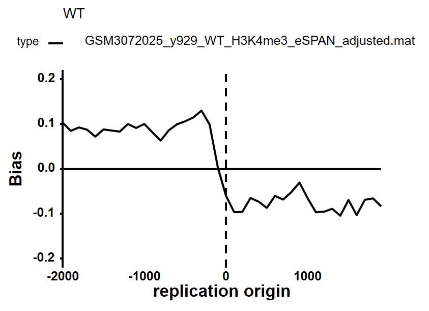

# eSPAN-bias
Bias calculation for eSPAN experiments

eSPAN (enrichment and sequencing of protein associated nascent DNA) method is able to analyze the enrichment of proteins of interest, including histones and its modifications, at replicating chromatin in a strand-specific manner in mammalian cells. Strand specific read coverage on plus and minus strands can be calculated from the clean bam file by [deeptools](https://deeptools.readthedocs.io/en/develop/content/tools/bamCoverage.html). Then read coverage bias can be analyzed by 'eSPAN-bias' scripts.

## Requirements
* deeptools
* R packages: "openxlsx_4.2.4", "GenomicRanges_1.40.0", "Rsamtools_2.4.0", "rtracklayer_1.48.0", "reshape2_1.4.4", "zoo_1.8", "ggplot2_3.3.2","plyr_1.8.6","pheatmap_1.0.12","RColorBrewer_1.1"
* R packages needed for 'pptx' output: "officer_0.3.14","rvg_0.2.5"

## Usage
The eSPAN-bias scripts provides the analysis of bias calculation based on bigwig files:
* cal_bias.R: Calculate read coverage bias for each sample
* normalize_bias.R: Normalize the eSPAN bias against the BrdU IP bias to exclude the background effects in replication
* draw_bias.R: Draw plot for bias results and group samples by user’s specification

Some example data from GSE112522 are deposited in folder 'example_data' for testing. Annotation files are deposited in folder 'annotation',including:

saccer3_G1_origin.bed, yeast early origins

saccer3_G2_origin.bed, yeast late origins

saccer3_TSS.bed, yeast gene TSS

***
### 1. Rscript cal_bias.R -h
```
Options:
        -w WATSON, --watson=WATSON
                Bigwig file of plus strand. (Required)
                Multiple files can be joined by ',', like 'sample1_plus.bw, sample2_plus.bw'.
        -c CRICK, --crick=CRICK
                Bigwig file of minus strand. (Required)
                Multiple files can be joined by ',', like 'sample1_minus.bw, sample2_minus.bw'. 
        -r REFERENCE_POINT, --reference_point=REFERENCE_POINT
                A BED file of interested annotations and the middle point will be aligned. (Required)
                Default is the yeast G1 replication origins.
        -m METHOD, --method=METHOD
                Method for bias calculation, should be 'partition' or 'log'. (Optional, default='partition')
                'partition' = (w+c) / (w-c)
                'log' = log2 (w / c)
        --bw=BW
                Output folder for bigwig signals of genome-wide bias.It can be loaded by IGV to check individual locus. (Optional, default='bw_bias')
        -o MATRIX, --matrix=MATRIX
                Output folder for bias matrix. Will be used for bias normalization or bias plot. (Optional, default='bias_matrix')
        -s SUMMATFILE, --sumMatFile=SUMMATFILE
                Summary of output matrix file. (Optional, default='my_bias_mat.xlsx')
        --flank=FLANK
                Flanking regions around the reference point. It should be two numeric values joined by ','. (Optional, default='-2000,2000')
                Positive value means downstream and negative value means upstream to the reference point.
        -b BIN, --bin=BIN
                Bin size for matrix calculation. (Optional, default=100)
        --smooth=SMOOTH
                Number of bins on each side will be used for smooth. (Optional, default=0)
        -t THRESHOLD, --threshold=THRESHOLD
                Regions with coverage less than this value will be sikpped. (Optional, default=0)
        -N N_THREAD, --N_thread=N_THREAD
                Number of parallel processing. (Optional, default=2)
        -f FORCE, --force=FORCE
                If not forced, existing files will be skipped for calculation again. (Optional, default=T)
```
` Rscript cal_bias.R -w example_data/GSM3072025_y929_WT_H3K4me3_eSPAN/GSM3072025_y929_WT_H3K4me3_eSPAN_plus.bw -c example_data/GSM3072025_y929_WT_H3K4me3_eSPAN/GSM3072025_y929_WT_H3K4me3_eSPAN_minus.bw -r annotation/saccer3_G1_origin.bed`
##### Output:
*bw_bias/GSM3072025_y929_WT_H3K4me3_eSPAN_partion.bw*,  genomwide bias signal.

*bias_matrix/GSM3072025_y929_WT_H3K4me3_eSPAN.mat*,    bias matrix surrounding the G1 origins.

*bias_matrix/GSM3072025_y929_WT_H3K4me3_eSPAN.txt*,     average bias profile surrounding the G1 origins.

##### Details:
* ‘--method’ can choose to use either partition or log2 ration method for bias calculation. Partition method is recommended, since it can scale the bias to (-1, 1).

|  |  |
| :--: | :--: |
| **(W+C)/(W-C)** | **log2(W/C)** |

* ‘--threshold’ can filter unreliable regions with low coverage by setting a proper coverage threshold and please set it based on your sequencing depth.

|  |  |
| :--: | :--: |
| **threshold=0** | **threshold=30** |

In this example, each row is an aligned replication origin and all origins are sorted from low to high replication efficiency. When setting the threshold=30, we only calculate the bias for origins of enough coverage and leave the low efficent origins blank. In this way, we get less but more reliable information in the genome-wide. 

* '--smooth' can smooth the matrix by averaging each bin from its flanking n bins. You'll consider it when the '--bin' is very small and the signal is noisy.

| |  |
|:--:|:--:|
|**smooth=0**|**smooth=5**|

### 2. Rscript  normalize_bias.R -h
```
Options:
        -i MATRIX, --matrix=MATRIX
                Bias matrix files generated by 'cal_bias.R'. (Required)
                Put all eSPAN and BrdU samples' matrix files here and join them by ','.
        -c CLASS, --class=CLASS
                Class of samples,such as 'brdu','H3K4me3_eSPAN' or 'H3K56ac_eSPAN'.(Required)
                It's used to pair samples for normalization. Length of sample 'class' should be same as matrix files and joined by ','.
       -C CONDITION, --condition=CONDITION
                Description of sample conditions, such as date, MNase, Sonication, mutant strains. For example, '2020_MNase_dpb3'. (Optional)
                Samples with exactly same 'condition' and matched 'class' will be paired together fornormalization.
                If not provied, all samples will be considered as same condition. Please check generated sample pair list to make sure normalizaton is as expected.
                Length of 'condition' should be same as matrix files and joined by ','.
        --target=TARGET
                The target class for pairing samples and should be words selected from 'Class'. (Optional, default='H3K4me3_eSPAN, H3K56ac_eSPAN')
                Length of 'target' should be same as 'control'.
        --control=CONTROL
                The control class for pairing samples and should be words selected from 'Class'. (Optional, default='BrdU, BrdU')
                Length of 'control' should be same as 'target'.
        -l LABEL, --label=LABEL
                Sample name labeling for the bias matrix file. (Optional)
                If not provided, file name will be used. Length of labels should be same as matrix files and joined by ','.
        -o NORMMATRIX, --normMatrix=NORMMATRIX
                Output folder for normalized bias matrix. They can be used for bias plot. (Optional, default='bias_norm_matrix')
        -s SUMMATFILE, --sumMatFile=SUMMATFILE
                Summary of output normalized matrix file. (Optional, default='my_norm_bias_mat.xlsx')
```

`Rscript normalize_bias.R -i 'bias_matrix/GSM3072013_y925_WT_BrdU.mat , bias_matrix/GSM3072025_y929_WT_H3K4me3_eSPAN.mat ' 
-c BrdU,H3K4me3_eSPAN --control=BrdU --target=H3K4me3_eSPAN`

##### Output:
*bias_norm_matrix/GSM3072025_y929_WT_H3K4me3_eSPAN_adjusted.mat*, Normalized bias matrix.

*bias_norm_matrix/GSM3072025_y929_WT_H3K4me3_eSPAN_adjusted.mat.txt*, Normalized bias profile.

*my_norm_bias.mat*, Summary of the normalization.

##### Details:
Normalize the eSPAN bias against the BrdU-IP-ssSeq bias.

|  |  |
| :--: | :--: |
| **Before normalization** | **After normalization** |


### 3. Rscript  draw_bias.R -h
```
Options:
        -h, --help
                Show this help message and exit

        -s SIGNAL, --signal=SIGNAL
                Average signal file (.txt) generated by 'cal_bias.R' or 'normalize_bias.R'. (Required)
                Files can be joined by ','.

        -o OUTPUT, --output=OUTPUT
                Output plot file. It can be 'pptx' or 'pdf' based on file suffix. (Optional, default='my_profile.pptx')

        -p PAGE, --page=PAGE
                Page label for samples. Samples with same page label will be plotted in one page. (Optional)
                Page label should be joined by ','. Length of page label should be same as signal files.
                If not provided, each sample will be plotted in a page.

        -g GROUP, --group=GROUP
                Group label for samples. Sample with same group label will be plotted in average. (Optional)
                Group label should be joined by ','. Length of group label should be same as signal files.
                If not provide, each sample will be plotted.

        --interval=INTERVAL
                When group label is specified, this flag is used to decide whether to plot the confidence interval for each group. (Optional,default=F)

        --legendNcol=LEGENDNCOL
                Number of columns for legend showing. (Optional, default=1)

        --xlab=XLAB
                X-axis labels. (Optional)

        --ylab=YLAB
                Y-axis labels. (Optional)

        --width=WIDTH
                Width for the plot. (Optional, default=5)

        --height=HEIGHT
                Height for the plot. (Optional, default=4)

        --ymin=YMIN
                Y-axis minimum value. (Optional, default=NA)

        --ymax=YMAX
                Y-axis maximum value. (Optional, default=NA)

        --ybreaks=YBREAKS
                Y-axis breaks value. (Optional, default=NA)
                
        --xmin=XMIN
                X-axis minimum value. (Optional, default=NA)
                
        --xmax=XMAX
                X-axis maximum value. (Optional, default=NA)

        --xbreaks=XBREAKS
                X-axis breaks value. (Optional, default=NA)
```

`Rscript draw_bias.R -s 'bias_matrix/GSM3072013_y925_WT_BrdU.txt , bias_matrix/GSM3072025_y929_WT_H3K4me3_eSPAN.txt, bias_matrix/GSM3072030_y1436_dpb3_BrdU.txt , bias_matrix/GSM3072038_y1439_dpb3_H3K4me3_eSPAN.txt' -p bias,bias,bias,bias -o 'all_bias_group.ppt' -g BrdU,H3K4me3,BrdU,H3K4me3 --interval=T`

##### Output:
*all_bias_group.pptx*,  Plots of bias profile.

*all_bias_group_heatmap.pdf*, Plots of bias heatmap.

##### Details:
Group the profiles and plot the average signal and variation.

|  |  |
| :--: | :--: |
| **Bias for each sample** | **Bias for BrdU group and eSPAN group** |


